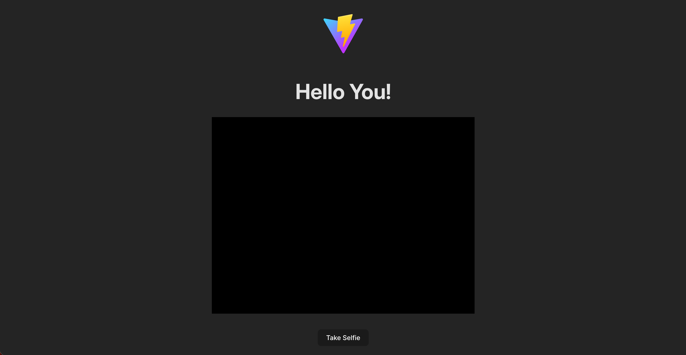

# Vite Selfie Cam

A small web application that uses modern browser APIs to provide a live camera preview and capture a photo directly in the browser.

## Table of Contents

-  [Overview](#overview)
-  [Features](#features)
-  [Screenshot](#screenshot)
-  [Links](#links)
-  [Built With](#built-with)
-  [Roadmap](#roadmap)
-  [Author](#author)
-  [Acknowledgments](#acknowledgments)

## Overview

This project is a lightweight vanilla JavaScript application built with Vite. It uses the MediaDevices API to access the user’s camera, displays a live video preview, and allows the user to capture a still image to a canvas.

The focus of the project is clarity, correct use of browser APIs, and clean separation between camera logic and UI behavior.

## Features

-  Live camera preview using the MediaDevices API
-  Capture a still image to a canvas
-  Toggle between live preview and captured photo (retake functionality)
-  No frameworks, pure modern JavaScript

## Screenshot

## Links

-  Live site - []
-  Repository - [https://github.com/yourusername/vite-selfiecam]

## Built With

-  HTML5
-  CSS
-  Vanilla JavaScript
-  Vite
-  Browser APIs (MediaDevices, Canvas)

## Roadmap

Possible future improvements:

-  Stop the camera stream when not in use
-  Allow saving the captured image
-  Improve mobile layout and responsiveness
-  Add small UI transitions for a smoother experience

## Author

Talay Yontem  
GitHub - [https://github.com/yourusername]

## Acknowledgments

This project was inspired by coursework from Frontend Masters. The original material covered browser APIs and camera access; additional features and UI behavior were implemented independently.

-  Frontend Masters - [https://frontendmasters.com/courses/javascript-projects/]
